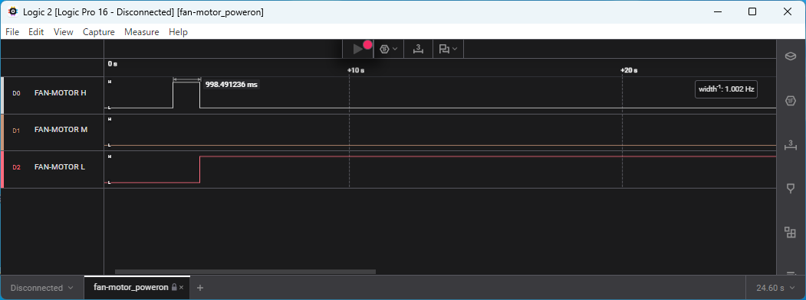
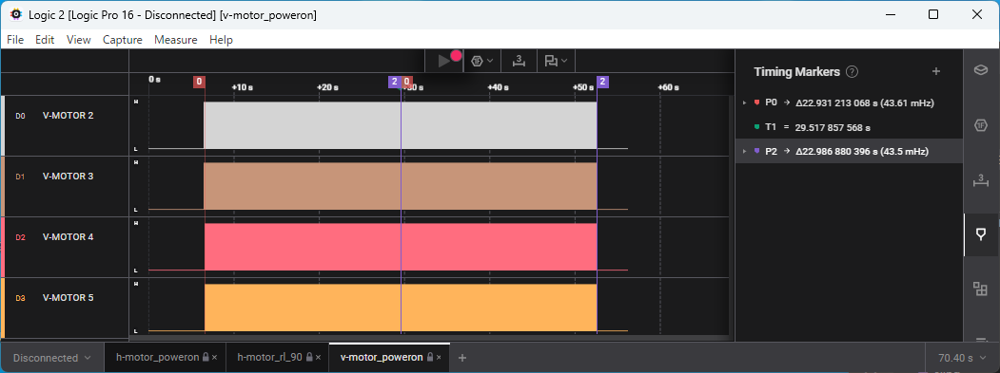

無印良品 360度首振り機能付きサーキュレーターをSeeed Studio XIAOで制御してみようプロジェクト。

# 改造するサーキュレーター

無印良品 360度首振り機能付きサーキュレーター6畳ホワイト MJ-OCF06


ガードを外した状態


## 上部の中身


* MST35 12V DC 0041/241030C NINGBO MINGSHENG
* ステッピングモーター

## 下部の中身


* SN8F570320ASG

* ULN2003G 7ch darlington sink driver

    

* AiP650EO 2-line Serial Interface/LED Driver with Keyboard

    

## 基板の解析


### U1

|Pin|Note|
|:--|:--|
|1|GND|
|2|V-MOTOR 2-Orange|
|3|V-MOTOR 3-Yellow|
|4|V-MOTOR 4-Purple|
|5|V-MOTOR 5-Blue|
|6|H-MOTOR 2-Orange|
|7|H-MOTOR 3-Yellow|
|8|H-MOTOR 4-Purple|
|9|H-MOTOR 5-Blue|
|10|LED Driver CLK|
|11|SW ON/OFF|
|12|SW SPEED|
|13|SW RL|
|14|SW UD|
|15|SW TIME|
|16|LED Driver DIO|
|17|FAN-MOTOR H-Red|
|18|FAN-MOTOR M-White|
|19|FAN-MOTOR L-Blue|
|20|+5V|

### FAN-MOTOR

* H,M,LのいずれかをHIGHでファン回転。
* Hは高速、Mは中速、Lは低速。




### H-MOTOR

* 電源オン時に29.3秒正転、14.8秒逆転。
* 2->3->4->5で正転。
* 切り替えタイミングは4ミリ秒。
* 加減速制御は無い。


### V-MOTOR

* 電源オン時に22.9秒正転、23.0秒逆転。
* 2->3->4->5で正転。
* 切り替えタイミングは6.0ミリ秒。
* 加減速制御は無い。




### LED Driver

* 常に通信。
* 199.6ミリ秒周期で5件。
* 1件は13.1ミリ秒。
* CLKのパルス幅は107マイクロ秒。


```
01101000 00001110 0x68 0x0E DIG1 x3-TIMER
01101010 00001100 0x6A 0x0C DIG2 x2-V
01101100 00111100 0x6C 0x3C DIG3 x3-H
01101110 00011110 0x6E 0x1E DIG4 x3-FAN,x1-POWER
01001000 00100001 0x48 0x21 Set system parameters
                              display on
                              sleep ode disable
                              eight segment
                              2 levels of brightness
```

```
01001000 00010001 0x48 0x21 Set system parameters
                              display on
                              sleep ode disable
                              eight segment
                              1 levels of brightness
```

# XIAOピン割当

x3 FAN-MOTOR
x4 H-MOTOR
x4 V-MOTOR
x2 LED Driver
x5 Button
